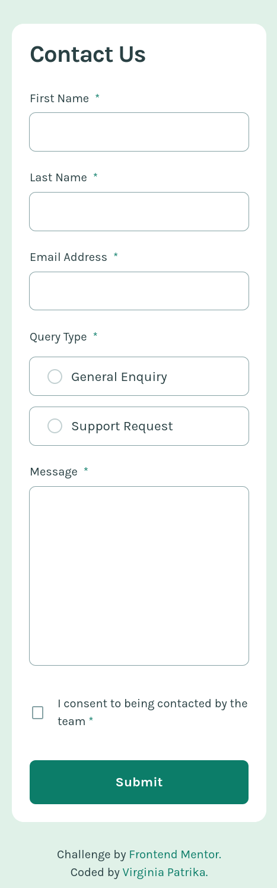
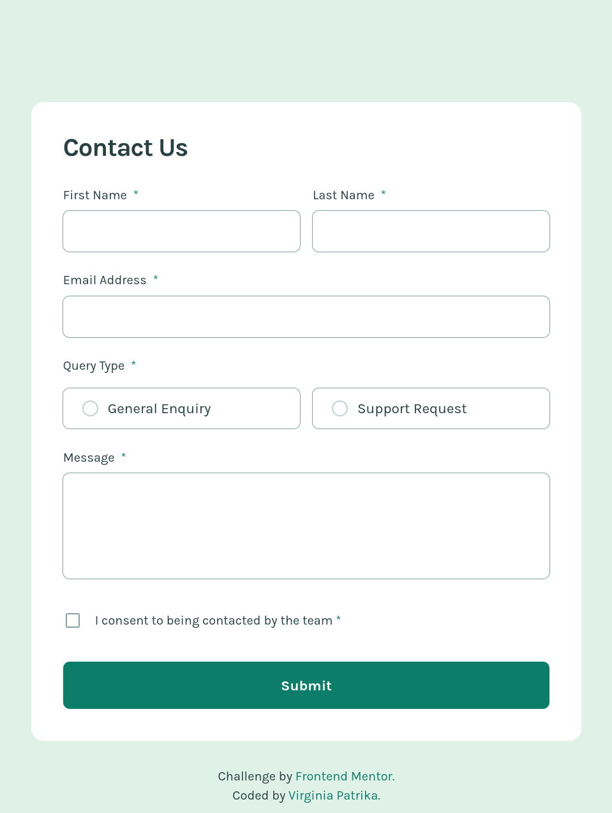
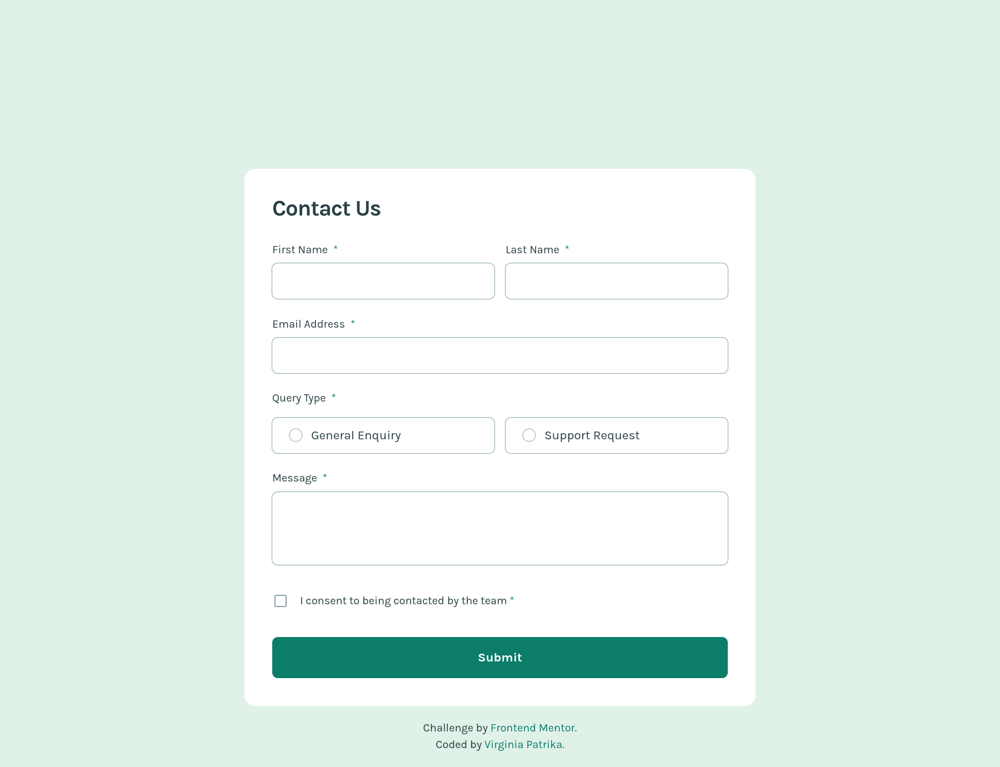

# Frontend Mentor - Contact form solution

This is a solution to the [Contact form challenge on Frontend Mentor](https://www.frontendmentor.io/challenges/contact-form--G-hYlqKJj). Frontend Mentor challenges help you improve your coding skills by building realistic projects.

## Table of contents

- [Overview](#overview)
  - [The challenge](#the-challenge)
  - [Screenshot](#screenshot)
  - [Links](#links)
- [My process](#my-process)
  - [Built with](#built-with)
  - [AI Collaboration](#ai-collaboration)
- [Author](#author)

## Overview

### The challenge

Users should be able to:

- Complete the form and see a success toast message upon successful submission
- Receive form validation messages if:
  - A required field has been missed
  - The email address is not formatted correctly
- Complete the form only using their keyboard
- Have inputs, error messages, and the success message announced on their screen reader
- View the optimal layout for the interface depending on their device's screen size
- See hover and focus states for all interactive elements on the page

### Screenshot

### Links

- Solution URL: [Github]()
- Live Site URL: [Netlify]()

## My process

### Built with

- Semantic HTML5 markup
- CSS custom properties
- Flexbox
- Tailwind
- Javascript

### AI Collaboration

I used Claude (Anthropic) as a learning assistant throughout this project.
Rather than asking it to write code for me, I used it as a mentor — asking
questions about best practices, accessibility, and JavaScript architecture
before writing each section myself.

It was particularly helpful for:

- Accessibility guidance (ARIA attributes, keyboard navigation, screen reader behavior)
- JavaScript architecture decisions (module pattern, DRY principles, validation patterns)
- Explaining concepts I hadn't encountered before (e.g. `peer` in Tailwind, `has-[]`, `every(Boolean)`)

What worked well was the back-and-forth approach — I would share my code,
get feedback, ask follow-up questions, and then implement the changes myself.
This helped me understand _why_ certain decisions were made, not just _what_ to write.

What didn't work as well was that occasionally I had to push back or question
suggestions — for example, noticing inconsistencies in the generated code (like
a missing `aria-required` on one radio button). This was actually a good reminder
that AI output always needs critical review.

## Author

- Frontend Mentor - [@VirginiaPat](https://www.frontendmentor.io/profile/VirginiaPat)
- GitHub - [VirginiaPat ](https://github.com/VirginiaPat)
- Netlify - [VirginiaPat](https://app.netlify.com/teams/virginia-patrika/sites)
